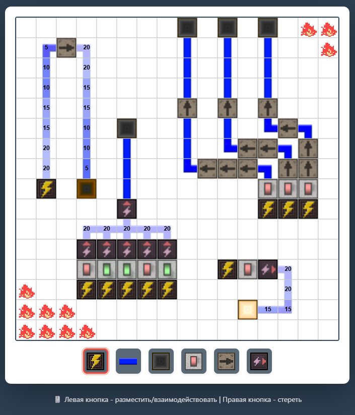

# Sandbox - Electric Circuit Simulator
**An interactive sandbox where you can build and test electrical circuits in real time. Place power sources, lay down wires, connect lamps, and watch energy flow through your circuit. Voltage drops with distance, and overloaded lamps burn out in flames.**

*Disclaimer: This is a simplified toy simulator made for fun and experimentation. The electrical logic does not follow real-world physics or proper electronic principles. Do not use it as an educational reference for actual electronics.*

***
## Features

- **Power Sources** - Generate energy that flows through your circuit
- **Wires** - Connect components and carry energy with distance-based voltage drop (20V → 15V → 10V → 5V → 0V)
- **Lamps** - Light up based on voltage level, burn out at 20V overload
- **Switches** - Toggle power flow on/off with a click
- **Repeaters** - Extend signal range by boosting energy back to full power
- **Inverters** - Logic NOT gate, outputs power only when input is off
***
## How It Works

1. Select a component from the palette at the bottom
2. Left-click on the grid to place it
3. Right-click to erase components
4. Hold and drag to draw wires or erase continuously
5. Click on switches, repeaters, or inverters to toggle/rotate them

Energy flows from power sources through blue wires. The further from the source, the weaker the voltage. Repeaters amplify the signal back to 20V. Inverters output 20V only when their input is off, enabling basic logic circuits.
***
*Made with ❤️ for tinkering and having fun*
